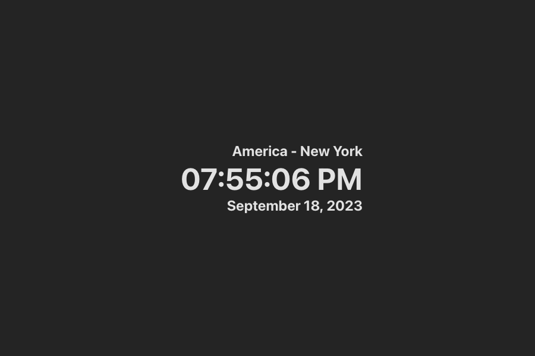
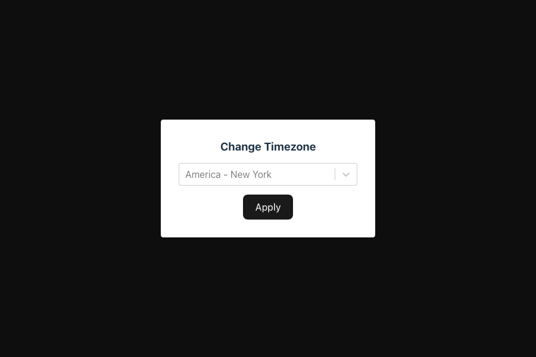

[![Contributors][contributors-shield]][contributors-url]
[![Forks][forks-shield]][forks-url]
[![Stargazers][stars-shield]][stars-url]
[![Issues][issues-shield]][issues-url]
[![MIT License][license-shield]][license-url]
![Top Tech][tech-shield]
![GitHub Workflow Status (with event)][github-status-shield]
[![LinkedIn][linkedin-shield]][linkedin-url]

# Time App

## Description

Time is a no-frills static web app built using React that displays the current time in a user's desired timezone. Click on the timezone to open a modal and select from all valid [IANA timezones](https://www.iana.org/time-zones). I built this web app to work on my front-end development skills using React, TS, CSS, and several external packages. Check out a demo [here](https://dominicgaliano.github.io/time-app/)!

<a href="https://dominicgaliano.github.io/time-app/"></a>
<a href="https://dominicgaliano.github.io/time-app/"></a>

## Installation

To run this project locally, follow the following commands (npm required):

1. Clone the repo

   ```sh
   git clone https://github.com/dominicgaliano/time-app.git
   cd time-app/
   ```

2. Install NPM packages

   ```sh
   npm i
   ```

3. Run local development server

   ```sh
   npm run dev
   ```

## Credits

Frameworks and Packages:

[![React][React.js]][React-url]
[![Typescript][Typescript.js]][Typescript-url]
[![Vite][Vite.js]][Vite-url]
[![DayJS][Day.js]][Dayjs-url]
[![React-Micromodal][RMM.js]][React-micromodal-url]
[![React-Select][RS.js]][react-select-url]

## License

Distributed under the MIT License. See `LICENSE.md` for more information.

## Features

- Allows user to select any valid [IANA timezones](https://www.iana.org/time-zones)
- Fully accessible using keyboard, mouse, or touch.
- Responsive layout using flexbox and auto margin.
- Supports all devices with width >320px (>98.5% of global users).
- Supports both light and dark themes based on browser settings.
- Clock and modal are fully accessible.

See the [open issues](https://github.com/dominicgaliano/time-app/issues) for a full list of proposed features (and known issues).

## How to Contribute

If you have a suggestion that would make this better, please fork the repo and create a pull request. You can also simply open an issue with the tag "enhancement".
Don't forget to give the project a star! Thanks again!

1. Fork the Project
2. Create your Feature Branch (`git checkout -b feature/AmazingFeature`)
3. Commit your Changes (`git commit -m 'Add some AmazingFeature'`)
4. Push to the Branch (`git push origin feature/AmazingFeature`)
5. Open a Pull Request

[contributors-shield]: https://img.shields.io/github/contributors/dominicgaliano/time-app.svg?style=for-the-badge
[contributors-url]: https://github.com/dominicgaliano/time-app/graphs/contributors
[forks-shield]: https://img.shields.io/github/forks/dominicgaliano/time-app.svg?style=for-the-badge
[forks-url]: https://github.com/dominicgaliano/time-app/network/members
[stars-shield]: https://img.shields.io/github/stars/dominicgaliano/time-app.svg?style=for-the-badge
[stars-url]: https://github.com/dominicgaliano/time-app/stargazers
[issues-shield]: https://img.shields.io/github/issues/dominicgaliano/time-app.svg?style=for-the-badge
[issues-url]: https://github.com/dominicgaliano/time-app/issues
[license-shield]: https://img.shields.io/github/license/dominicgaliano/time-app.svg?style=for-the-badge
[license-url]: https://github.com/dominicgaliano/time-app/blob/master/LICENSE.txt
[linkedin-shield]: https://img.shields.io/badge/-LinkedIn-black.svg?style=for-the-badge&logo=linkedin&colorB=555
[linkedin-url]: https://linkedin.com/in/dominic-galiano
[tech-shield]: https://img.shields.io/github/languages/top/dominicgaliano/time-app.svg?style=for-the-badge
[github-status-shield]: https://img.shields.io/github/actions/workflow/status/dominicgaliano/time-app/main.yml.svg?style=for-the-badge
[React.js]: https://img.shields.io/badge/React-20232A?style=for-the-badge&logo=react&logoColor=61DAFB
[React-url]: https://reactjs.org/
[Typescript.js]: https://shields.io/badge/TypeScript-3178C6?style=for-the-badge&logo=TypeScript&logoColor=61DAFB
[Typescript-url]: https://www.typescriptlang.org/
[Vite.js]: https://img.shields.io/badge/vite-%23646CFF.svg?style=for-the-badge&logo=vite&logoColor=white
[Vite-url]: https://vitejs.dev/
[Day.js]: https://img.shields.io/badge/Day.js-20232A?style=for-the-badge
[Dayjs-url]: https://day.js.org/
[RMM.js]: https://img.shields.io/badge/react%20micro%20modal-20232A?style=for-the-badge
[React-micromodal-url]: https://www.npmjs.com/package/react-micro-modal
[RS.js]: https://img.shields.io/badge/react%20select-20232A?style=for-the-badge
[react-select-url]: https://react-select.com/
